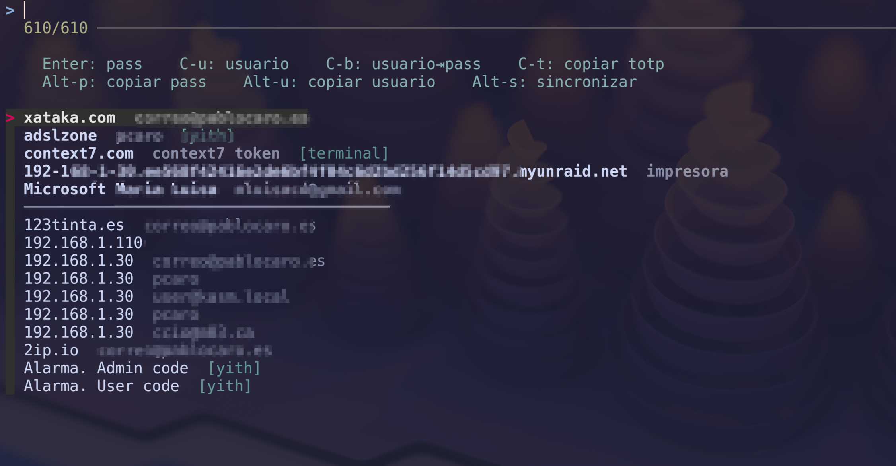

# kitty_rbw

A [kitty](https://sw.kovidgoyal.net/kitty/) kitten to quickly search and use [rbw](https://github.com/doy/rbw) (unofficial Bitwarden CLI) credentials directly from the terminal.



## Features

- **Fuzzy search** through your vault using `fzf` — searches by name, username and folder simultaneously.
- **Direct injection**: types password or username directly into the active terminal window.
- **Clipboard support**: copy password, username or TOTP code to clipboard.
- **TOTP support**: copy the 2FA code for entries that have it configured.
- **Most-used first**: the 10 most frequently used entries appear at the top in bold, separated from the rest.
- **Folder shortcuts**: launch the kitten pre-filtered to a specific folder via `kitty.conf` arguments.
- **Duplicate-safe**: internally uses UUIDs, so entries with the same name are always resolved correctly.
- **Sync**: refresh your local vault without leaving the kitten.

## Requirements

- [kitty](https://sw.kovidgoyal.net/kitty/) terminal
- [rbw](https://github.com/doy/rbw) installed and configured (`rbw login` / `rbw unlock` done at least once)
- [fzf](https://github.com/junegunn/fzf) installed

## Installation

1. Clone into your kitty config directory:
   ```bash
   cd ~/.config/kitty
   git clone https://github.com/pcaro/kitty_rbw
   ```

2. Add a shortcut to `kitty.conf`:
   ```
   map kitty_mod+b kitten kitty_rbw/rbw.py
   ```

## Usage

Press the configured shortcut to open an overlay with your vault entries. The list shows name, username (dimmed) and folder (in cyan) for each entry.

### Key bindings

| Key | Action |
|-----|--------|
| `Enter` | Type the **password** into the terminal |
| `Ctrl+u` | Type the **username** into the terminal |
| `Ctrl+b` | Type **username**, `Tab`, then **password** (useful for login forms) |
| `Ctrl+t` | Copy the **TOTP** code to clipboard |
| `Alt+p` | Copy the **password** to clipboard |
| `Alt+u` | Copy the **username** to clipboard |
| `Alt+s` | Sync the vault and refresh the list |
| `Esc` | Cancel |

### Folder shortcuts

You can pass a folder name as an argument to pre-filter the list:

```
map kitty_mod+b       kitten kitty_rbw/rbw.py
map kitty_mod+shift+y kitten kitty_rbw/rbw.py yith
map kitty_mod+shift+t kitten kitty_rbw/rbw.py terminal
```

The folder name is case-insensitive.

## Usage history

The kitten tracks how often each entry is used and stores a counter in `~/.local/share/kitty_rbw/usage.json` (permissions `0700`/`0600`). The top 10 most-used entries are shown first. The file contains only UUIDs, counts and timestamps — no passwords or usernames.

## License

MIT
